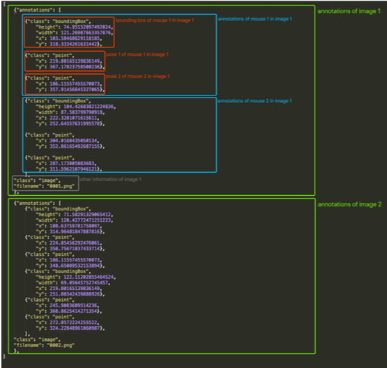

\pagebreak
\tableofcontents
\pagebreak

# Introduction

## Project Overview

AlphaTracker is a groundbreaking multi-animal tracking and behavioral analysis tool that revolutionizes system neuroscience research. Designed to empower researchers, it incorporates advanced features such as multi-animal tracking, pose estimation, and unsupervised behavioral clustering. AlphaTracker sets new standards in accuracy for multi-animal tracking, providing a strong foundation for rigorous biological studies.

The application's exceptional capabilities stem from cutting-edge computer vision and machine learning techniques. By seamlessly integrating multi-animal tracking and pose estimation, AlphaTracker enables researchers to gain deeper insights into the complex interactions and behaviors of multiple subjects in real-time video streams.

One of the key strengths of AlphaTracker lies in its adaptability to diverse research settings. The application is designed to operate with minimal hardware requirements, making use of regular webcams, and boasts an efficient training procedure. This ease of adoption facilitates widespread usage across various neuroscience laboratories, ensuring researchers can readily harness its potential for their experiments.

The AlphaTracker project is the result of the collective efforts of a highly skilled and collaborative team, comprising computer vision engineers, machine learning experts, and software developers. Each member's expertise plays a crucial role in developing specific components of the application, culminating in an integrated and high-performing solution.

Within this report, the focus centers on my individual contributions to the AlphaTracker project. It presents in-depth insights into the methodologies I employed, the challenges I encountered, and the results achieved during my involvement. By sharing my accomplishments, I aim to highlight the significance of my work within the team and demonstrate how it contributes to the success of AlphaTracker as a groundbreaking tool for advancing system neuroscience research.

## Role and Responsibilities

As a member of the support group for AlphaTracker, I was part of a team of master's degree students working closely with the main developers, who were primarily PhD researchers. Our role in the project was vital in assisting the core team with various essential tasks, contributing to the overall success of the application's development and refinement. Our responsibilities encompassed a diverse range of activities, each tailored to complement the expertise of the main developers and ensure the efficient progression of the project.

1. Data Preparation: One of our key responsibilities was to handle data preparation, including data collection, cleaning, and organization. We ensured that the datasets used for model training and evaluation were curated meticulously to provide accurate and reliable inputs for the algorithms.

2. Model Training, Correction, and Visualization: Our team actively engaged in model training, fine-tuning, and corrections. We worked collaboratively to optimize the performance of the tracking and pose estimation models, employing cutting-edge computer vision and machine learning techniques. Additionally, we developed visualizations to analyze model outputs and identify potential areas for improvement.

3. Metric Development and Testing: Another crucial aspect of our role was the development and testing of various evaluation metrics. We designed and implemented metrics to assess the tracking accuracy, pose estimation precision, and clustering performance, thereby contributing to the quantitative evaluation of the application's capabilities.

4. Evaluation of Pose Estimation: We dedicated effort to rigorously evaluating the pose estimation functionality within AlphaTracker. By conducting thorough assessments and comparisons with ground truth data, we helped ensure the accuracy and reliability of the pose estimation algorithms.

5. Clustering Algorithm Testing: Our team also played a significant role in testing different clustering algorithms, both for visual and audio data. This involved conducting experiments and analyzing results to determine the most effective approach for behavioral clustering.

6. Documentation and Reporting: Throughout the project, we diligently documented our work, methodologies, and results. We prepared detailed reports and contributed to the project's documentation, providing clear and comprehensive insights into our contributions and findings.

7. Continuous Collaboration and Support: As a support group, we maintained open and effective communication with the main developers. We actively participated in team meetings, discussions, and brainstorming sessions, offering valuable inputs to enhance the application's functionality and addressing challenges collaboratively.

Our contributions as a support group significantly enriched the development process of AlphaTracker, helping to bridge the gap between research and application. By taking on diverse responsibilities and leveraging our skills, we played a crucial role in the success of the project, contributing to the advancement of system neuroscience research and the empowering tools for the scientific community.

## Scope of Work

As a member of a project support group, my role is to assist developers with tasks as needed. Not having belonged to the project since its inception, the main tasks in which I have given support have not been related to software development of the application itself, but have been more related to more technically simple and experimental tasks. In any case, the understanding of the operation of the application and its software structure has been necessary to perform these tasks. Finally, the objective of this project also lies in learning the techniques used in the project and the appropriate methodology for the development of a technological project of this category.

# AlphaTracker Description

The AlphaTracker pipeline consists of three main stages: tracking (AlphaTracker), behavioral clustering, and result analysis with a customized user interface (UI). AlphaTracker allows for multi-animal tracking on videos recorded via webcam, making it convenient and cost-effective for laboratory settings. The behavioral clustering stage enables unbiased identification of behavioral motifs, with results further reviewed and error-corrected using a customized UI.

The tracking component (AlphaTracker) is adapted from AlphaPose15, a human pose estimation algorithm. It comprises three steps: animal detection using YOLOv316, keypoint estimation using Squeeze-and-Excitation Networks (SENet)17, and identity (ID) tracking across frames. The pipeline proposes a novel target association method to consistently track IDs of nearly identical animals by defining descriptors for animal positions and orientations and calculating similarities between descriptors for tracking.

To address inaccuracies due to tracking errors or occlusion, the pipeline utilizes Kalman filtering21 to predict keypoint locations in consecutive frames. This filtering technique models motion with velocity and acceleration, providing enhanced tracking accuracy when users amend results in the UI.

The pipeline's innovative approach to multi-animal tracking, behavioral clustering, and result analysis using a user-friendly interface demonstrates its potential to advance system neuroscience research and empower researchers in their studies of animal behavior. [@alphatracker]

## Tracking

AlphaTracker demonstrates reliable performance in tracking multiple unmarked animals. It excels in complex environments like home cages with bedding and metal operant chambers, achieving high accuracy.

The tool handles challenges posed by occlusion due to head implants, maintaining robust performance. It also exhibits good tolerance for low-resolution videos from webcams (576p), enabling continuous monitoring over extended periods.

In social neuroscience research, AlphaTracker efficiently tracks four identical-looking mice during home cage interaction.

The model can be quickly and easily trained, involving two steps: training the animal detector and training the pose estimator. Users can modify training hyperparameters to optimize performance without overfitting risks.

AlphaTracker offers a rapid and accessible solution for neuroscience labs, as testing showed quick training times (0.2 seconds for a batch of 10 images and 30 minutes for 6000 training images) on compatible hardware. [@alphatracker]

## Clustering

AlphaTracker's behavioral clustering allows unsupervised clustering of individual and social behaviors, minimizing human bias. Features extracted from keypoints and binary masks are input to the hierarchical clustering algorithm. It successfully captures various behaviors and facilitates associative analysis between behavior motifs and experimental factors. The algorithm's performance is validated using the Adjusted Rand Index (ARI), showing improved results with larger datasets. AlphaTracker can be operated on Google Colab without GPUs, offering accessibility and comparable performance to local GPU-enabled setups. Detailed usage guidance can be found in the project's Github repository. [@alphatracker]

## User Interface

Customized user interfaces (UIs) for inspecting and revising tracking and clustering results were designed to address potential errors in the deep learning framework. The web-based UIs run on systems with a pre-installed Python environment.

The tracking UI enables users to scroll through the video, inspect keypoints, and verify mouse IDs over time. The event timeline facilitates error identification, displaying the confidence score to indicate periods of low confidence. Users can easily correct errors by dragging keypoints or reassigning identities. The "curate" function automatically corrects subsequent frames based on user adjustments.

The clustering UI features an interactive dendrogram to display clustering results. Users can choose to view broader cluster assignments or explore details. The scatterplot in the timeline visualizes clip distributions of specific clusters. Users can rename clusters, modify assignments, merge clusters, and save curated results in JSON format for further analysis. [@alphatracker]

# Tasks Description

In this section I will focus on my personal work produced in every task we received. I will expose the problems I faced, the methodology I used and the results I obtained.

## Task 1: Data Preparation

### Description of the task

The first step of this task was to investigate how the *AlphaTracker* application worked. This step was needed for us to manipulate the data, because we had to know how the data was structured in a first step in order to transformed it to the desired format. Likewise, there were multiple files, so it was crucial for us to identify which files corresponded to which information.

Once we had a more complete view of the project, our objective was to manipulate the data. We were given several *.csv* files and we had to generate *.json* files with a concrete format. (See in ...)



We had to generate just one output file, so we also had to merge all the information of the different *.csv* files we got as inputs.

We divided the main task in different subtasks, so I decided to go with the cleaning and merging part.

### Approach and Methodology Used

Since I had some experience with data manipulation in python, I decided to use it as the main tool for this project. In this case, I thought it would be useful to generate some scripts that cleaned, merged and finally transformed the data.

In order to generate these scripts, I firstly created a python notebook (more interactive and easier to debug), and when I obtained the desired code, I  turned those notebooks into *.py* files (faster and less expensive).

### Challenges Encountered and Solutions Implemented

The first challenged I faced when I tried to visualize the data was that some of the files could not be loaded. The cause of this problem was that most of the raw data had been manually introduced, so it contained some human errors. In order to solve this problem, I tried to load every file in python with a loop over the directory and I checked the error information of the python cell to figured out which file was causing the problem. Then, I focused on that file to discover which row was causing the problem. Due to this problem just affected to a few number of files, it was not worth it to develop an automatic solution, and I could fix all the files in a reasonable amount of time.

Once I got every file ready, the next step was to clean every file and set them in the same format so I could merged them after. For this step, I created the *clean_data.ipynb* notebook. This notebook works as follows:

- Rename the columns
- Set the index
- Delete useless columns
- Modify the headers
- Remove rows with the information of the headers

Once I checked every step worked properly, I generated the *clean_data.py* script and I executed it in every file with a for loop in the ubuntu terminal.

You can see the code at the end of the document.

The following step was to merge every file in one unique *.csv* file. For this task I created the *csv_generator.ipynb* file. The notebook works as follows:

- Create a list with all csv files
- Load all the datasets in one data frame
- Sort the data frame by the csv index and the png file name
- Create new features for both mouse 1 and mouse 2
- Set the final columns
- Write the data frame into a csv file

Since this task did not have to be repeated many times, I didn't generate the script and I just ran the notebook.

You can see the code at the end of the document.

### Results and Future work

The completion of this steps resulted in the desired output, a csv file with every frame information completed, cleaned and sorted. The next step would be to generate the *.json* file, but this specific task was part of the work of other teammate.

## Task 2: Model Training

### Description of the task

The main objective of this task was to interact with the AlphaTracker application to better understand how it works. Firstly we need to install the program, then verify the installation, set up the configurations and train the model. We were encouraged to train the model separately on different datasets based on the number of mice in the images.

### Approach and Methodology Used

We followed the steps given by the official instructions of the AlphaTracker app. [@alphagit]


### Challenges Encountered and Solutions Implemented

### Results and Future work

## Task X: 

### Description of the task

### Approach and Methodology Used

### Challenges Encountered and Solutions Implemented

### Results and Future work

## Task X: 

### Description of the task

### Approach and Methodology Used

### Challenges Encountered and Solutions Implemented

### Results and Future work

# Summary of Contributions

## Overview of my Overall Impact on the Project

## Key Accomplishments

## Challenges Overcome

# Lessons Learned

## Skills Developed or Enhanced

## Knowledge Gained

## Reflections on the Project Experience

# Conclusion

## Recap of my Contributions

## Acknowledgment of Team Members

## Future Directions or Recommendations

# References

@article{alphatracker,
  author={Zexin Chen},
  title={AlphaTracker: A Multi-Animal Tracking and Behavioral Analysis Tool},
  year={2020},
}

@misc{alphagit,
  author = {ZexinChen},
  title ={{AlphaTracker}},
  howpublished = "\url{https://github.com/ZexinChen/AlphaTracker}",
  year = {2022}
}

# Appendices

## Additional Supporting Material (if necessary)

## Code Snippets

clean_data.py:

```py
#!/usr/bin/env python3

"""This script must be executed from the raw_data directory. Type:
for FILE in *; do python3 ../clean_data.py $FILE; done"""

import pandas as pd
import os
import sys

# Get the file name from command line argument
file_name = sys.argv[1]

# Create the path to the file
data_path = os.path.join(os.getcwd(), file_name)

# Load the data into a Pandas DataFrame
df = pd.read_csv(data_path)

# Rename the columns
df = df.rename(columns={
    "Unnamed: 1": "csv_index", 
    "Unnamed: 2": "file_name"
})

# Set the csv index and file name as the DataFrame index
df = df.set_index(["csv_index", "file_name"])

# Drop the first column as it doesn't contain useful information
df = df.iloc[:, 1:]

# Get the first three rows to modify the headers
headers = df.iloc[:3, :].copy()

# Concatenate the first three rows to form the new headers
new_headers = []
for i in range(headers.shape[1]):
    new_header = "_".join(headers.iloc[:, i].tolist())
    new_headers.append(new_header)

# Drop the first three rows from the DataFrame
df = df.iloc[3:, :]

# Rename the columns with the new headers
df.columns = new_headers

# Save the cleaned data to a new file
cleaned_data_path = os.path.join(os.pardir, "cleaned_data", f"cleaned_{file_name}")
df.to_csv(cleaned_data_path)
```

csv_generator.ipynb:

```py
# Import libraries
import pandas as pd
import numpy as np
import os

# List with all csv files
csv_path = os.path.join(os.getcwd(), "cleaned_data")
csv_files = os.listdir(csv_path)
csv_files_path = list(("cleaned_data/" + csv for csv in csv_files))

# Load all the datasets in one data frame
df = pd.concat(map(pd.read_csv, csv_files_path))

# Sort the data frame by the csv index and the png file name
df = df.set_index(["csv_index", "file_name"])
df = df.sort_index()

df["mouse1_topleft_x"] = pd.to_numeric(df["mouse1_topleft_x"], errors='coerce')

# Create new features for mouse 1
df["height_1"] = df["mouse1_topleft_y"] - df["mouse1_rightdown_y"]
df["width_1"] = df["mouse1_rightdown_x"] -  df["mouse1_topleft_x"]
df["x_1"] = df["mouse1_topleft_x"]
df["y_1"] = df["mouse1_rightdown_y"]

# Create new features for mouse 2
df["height_2"] = df["mouse2_topleft_y"] - df["mouse2_rightdown_y"]
df["width_2"] = df["mouse2_rightdown_x"] -  df["mouse2_topleft_x"]
df["x_2"] = df["mouse2_topleft_x"]
df["y_2"] = df["mouse2_rightdown_y"]

# Set the final columns
columns = df.columns[4:-8]
columns = (df.columns[-8:]).append(columns)

# Generate the final data frame with the desired columns
df = df[columns]

# Write the data frame into a csv file
df.to_csv("processed_data.csv")
```